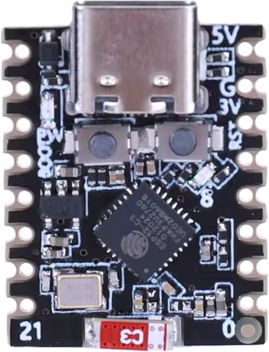

# Espressif ESP32-C3-DevKitM-1

## How to get the basic "blink" sketch working on an ESP32-C3 "Super Mini" board

The board was purchased from [AliExpress](https://www.aliexpress.com/item/1005007496189056.html), described as "ESP32-C3 SuperMini WiFi Bluetooth-Compatible Board ESP32 C3 SuperMini Development Board IOT Board for Arduino".



It matches the [PlatformIO description](https://docs.platformio.org/en/latest/boards/espressif32/esp32-c3-devkitm-1.html) for this board.

However, the [Espressif board](https://docs.espressif.com/projects/esp-dev-kits/en/latest/esp32c3/esp32-c3-devkitm-1/index.html) differs, eg it has an onboard RGB LED and many more IO pins.

Has an onboard blue LED connected to GPIO 8, but the logic is inverted, so:
```arduino
digitalWrite(LED_BUILTIN, HIGH);
```
turns the LED off, and:
```arduino
digitalWrite(LED_BUILTIN, LOW);
```
turns it on. The ```LED_BUILTIN``` constant is wrong, so you will need to re-define it:

```arduino
#define LED_BUILTIN 8
```

## Thanks to
https://done.land/components/microcontroller/families/esp/esp32/developmentboards/esp32-c3/c3supermini/
